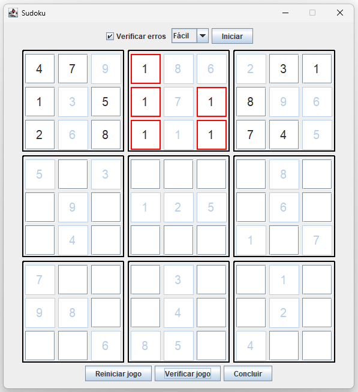

# Jogo de Sudoku em Java

Esta aplicação foi desenvolvida como parte de um **desafio de projeto** da _Digital Innovation One (DIO)_.
Seu objetivo é demonstrar o uso da linguagem Java, com implementações tanto em **linha de comando** quanto em **interface gráfica (Swing)**, para criar um jogo completo de **Sudoku**.

Ambas as versões utilizam arquivos de configuração para definir diferentes **níveis de dificuldade** e oferecem interações específicas com o jogador,
como _seleção de dificuldade_, _verificação de erros_ e _controle de status do jogo_.

---

## Descrição do desafio
Os requisitos abaixos foram implementados durante as [aulas](https://github.com/digitalinnovationone/sudoku).

### Requisitos
- [x] 1 - O código deve iniciar com um menu interativo com as opções:
  - Iniciar um novo jogo
  - Colocar um novo número
  - Remover um número
  - Verificar jogo
  - Verificar status do jogo
  - Limpar
  - Finalizar o jogo
- [x] 2 - Ao iniciar o jogo, exibir apenas os números iniciais definidos em arquivos
- [x] 3 - Não permitir inserir número em posição já preenchida (fixo ou pelo usuário)
- [x] 4 - Não permitir remover número fixo
- [x] 5 - Verificar se o jogo está:
  - Não iniciado
  - Incompleto
  - Completo
  - Com ou sem erros
- [x] 6 - Finalizar o jogo apenas se todos os números estiverem corretos

### Requisitos opcionais
- [x] 1 - Usar ambiente gráfico (Swing)
- [ ] 2 - Ter opção de colocar números de rascunho nos quadrados

---

## Funcionalidades adicionais implementadas
As melhorias e funcionalidades extras abaixo foram desenvolvidas por mim:

### Funcionalidades gerais
- [x] Os arquivos `.txt`, organizados por dificuldade em `/resources/difficulty/`, definem a configuração inicial do tabuleiro
- [x] O arquivo define as informações iniciais de cada espaço do tabuleiro:
  - Linha
  - Coluna
  - Valor esperado
  - Se o valor é fixo ou editável
- [x] Substituição do uso de argumentos (`args`) no `main` por arquivos externos para configurar o tabuleiro
- [x] Cada dificuldade possui **dois arquivos** distintos, permitindo variedade nos jogos e extensibilidade

### Exclusivas da versão em terminal (CLI)
- [x] Refatoração de código para evitar duplicações
- [x] Ao iniciar, permite ao jogador escolher:
  - Dificuldade (fácil, médio, difícil)
  - Arquivo desejado (1 ou 2)

### Exclusivas da versão com interface gráfica (Swing)
- [x] Ao iniciar, carrega automaticamente o nível fácil com o arquivo 1
- [x] ComboBox para selecionar a dificuldade (fácil, médio, difícil)
  - O arquivo 1 ou 2 é selecionado aleatoriamente
- [x] CheckBox para ativar ou desativar os avisos de erro ao inserir um número inválido
- [ ] ComboBox para definir o número máximo de erros permitidos (0, 3 ou 5)
  - Ao atingir o limite escolhido, o jogo é encerrado automaticamente

---

## Como executar

### Interface gráfica (Swing)

Execute o arquivo `GUIMain.java`

### Linha de comando (terminal)
Execute o arquivo `CLIMain.java`

---

## Imagens do Projeto

### Tabuleiro com erro

